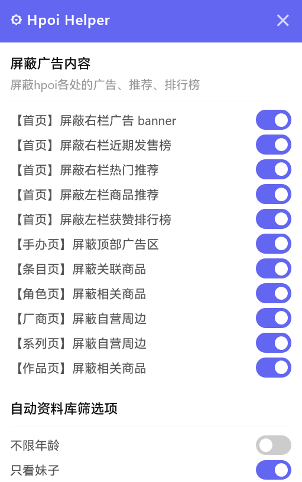

# Hpoi Helper

[hpoi.net](https://www.hpoi.net) 增强脚本——基于 Tampermonkey，使用 TypeScript + Vite 构建。

## 安装

1. 安装 [Tampermonkey](https://www.tampermonkey.net/) 浏览器扩展
2. 安装 [脚本](https://raw.githubusercontent.com/blurSong/hpoi-helper/main/dist/hpoi-helper.user.js)

**从源码构建安装：**

```bash
git clone <repo-url> && cd hpoi-helper
pnpm install && pnpm build
```

构建产物位于 `dist/hpoi-helper.user.js`，在 Tampermonkey 管理面板中选择「从文件安装」导入。

## 使用

安装后访问 hpoi.net 的任意页面，右下角会出现一个 **⚙** 悬浮按钮。

点击按钮打开设置面板，即可启用各项功能并调整选项。所有设置实时生效，刷新页面后保持。



## 功能列表

### 屏蔽噪音内容

分别屏蔽首页、手办页和条目页的广告、推荐、排行榜等干扰内容。

| 开关 | 效果 |
|---|---|
| 【首页】屏蔽右栏广告 banner | 隐藏首页右栏的广告轮播及快捷入口图片 |
| 【首页】屏蔽右栏近期发售榜 | 隐藏首页右栏的近期发售/周边期待榜 |
| 【首页】屏蔽右栏热门推荐 | 隐藏首页右栏的热门推荐文章列表 |
| 【首页】屏蔽左栏商品推荐 | 隐藏首页左栏的淘宝自营商品推荐 |
| 【首页】屏蔽左栏获赞排行榜 | 隐藏首页左栏的获赞排行榜 |
| 【手办页】屏蔽顶部广告区 | 隐藏手办分区首页顶部的活动轮播和自营店广告图 |
| 【条目页】屏蔽关联商品 | 隐藏条目详情页底部的淘宝关联商品推荐区 |
| 【角色页】屏蔽相关商品 | 隐藏角色详情页底部的相关商品推荐区 |
| 【厂商页】屏蔽自营周边 | 隐藏厂商详情页顶部的淘宝自营周边推荐区 |
| 【系列页】屏蔽自营周边 | 隐藏系列详情页的淘宝自营周边推荐区 |
| 【作品页】屏蔽相关商品 | 隐藏作品详情页的淘宝相关商品推荐区 |

> 当首页右栏三项全部开启时，中间信息流自动扩展至 75% 宽度。

### 自定义浏览

在资料库页（`/hobby/all`）自动修改 URL 参数，无需手动设置筛选条件。

| 开关 | 效果 | 默认 |
|---|---|---|
| 不限年龄 | 自动添加 `r18=-1`，显示所有年龄段商品 | 关闭 |
| 只看妹子 | 自动添加 `sex=0`，只显示女性角色商品 | 关闭 |

## 开发

```bash
pnpm install
pnpm dev      # 启动开发服务器（Tampermonkey 安装代理脚本后自动热重载）
pnpm build    # 生产构建 → dist/hpoi-helper.user.js
pnpm test     # 运行测试
```

详见 [CLAUDE.md](./CLAUDE.md)。

## 参考项目

架构参考 [Bilibili-Evolved](https://github.com/the1812/Bilibili-Evolved)。

## License

MIT
